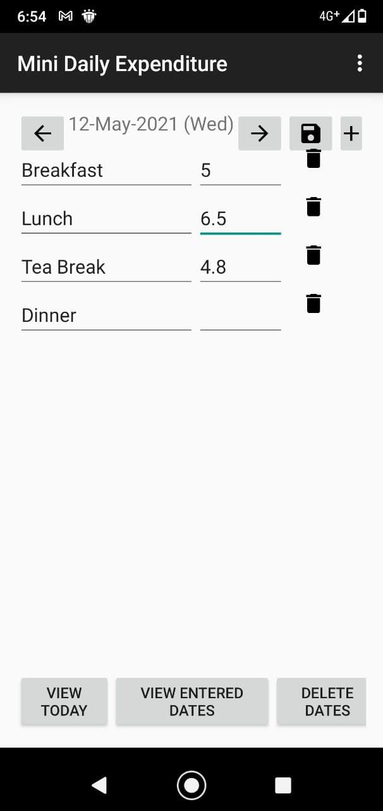
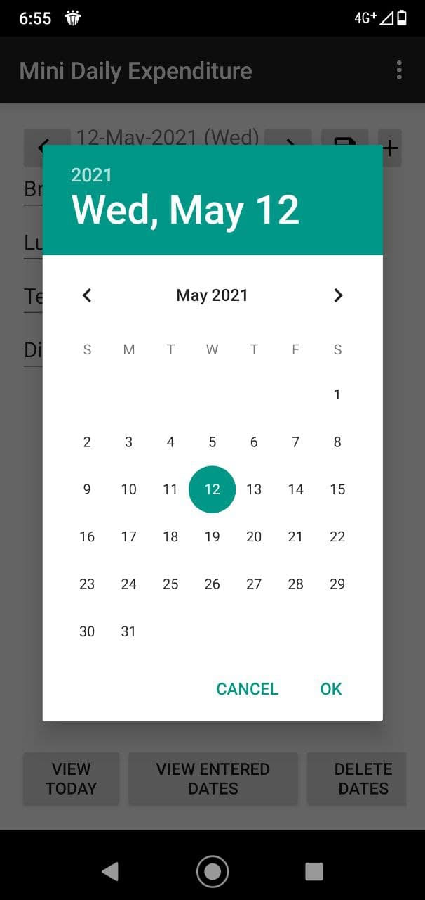
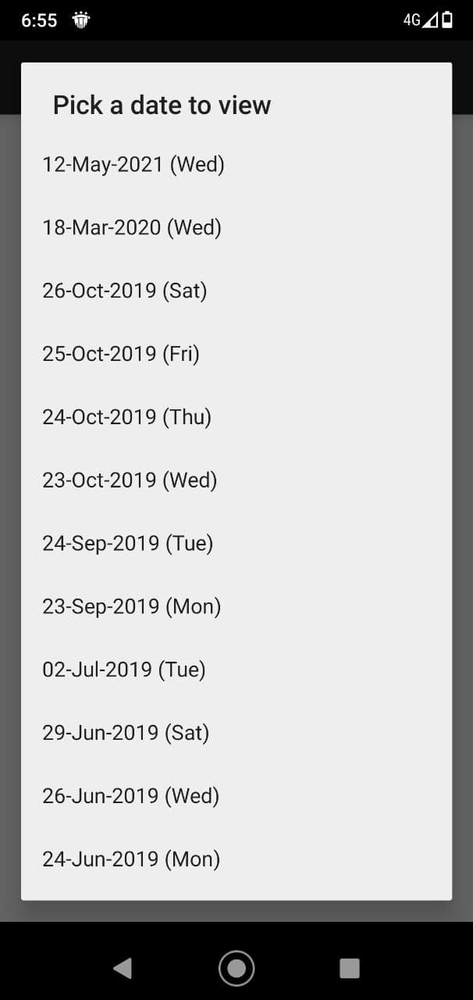

# daily-expenditure-mobile

An Android application that allows to record daily expenditure and the information is stored locally.

## Functionality

* Pre-populate frequently entered entries
* Select days with recorded entries
* Add and remove entries
* Deleted day with recorded entries

## Screenshots

## Impetus

Back in 2015 when the Author wanted to learn about Android development as well as wanted to build a mobile productivity app for himself, he chooses  to build an application where he can record down his daily expenditure and stored it so that he can reconcile back in his master file.
